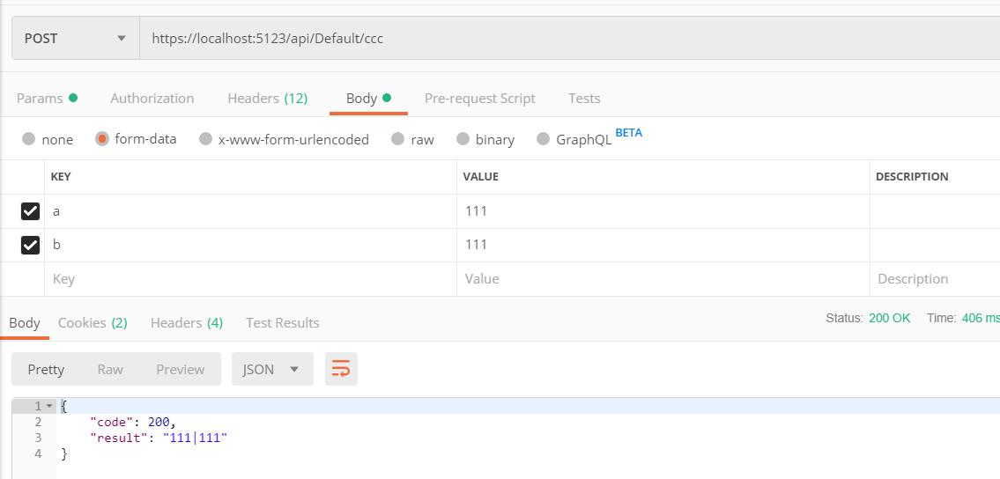
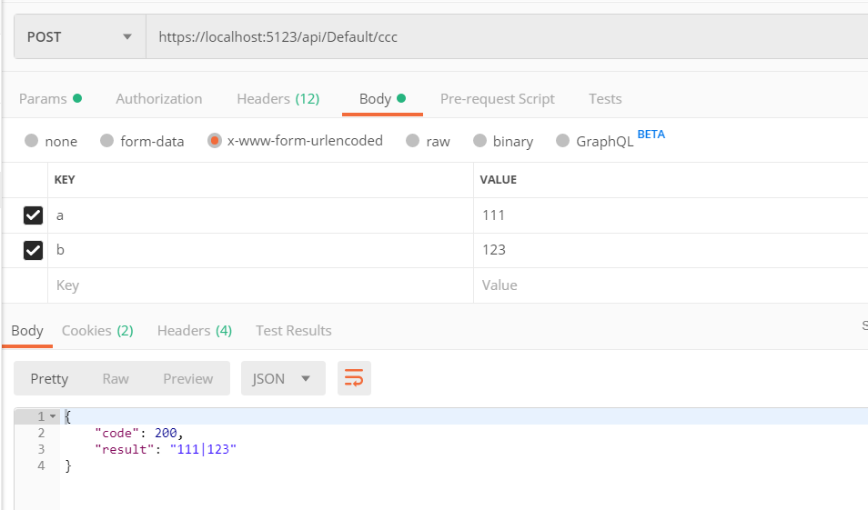
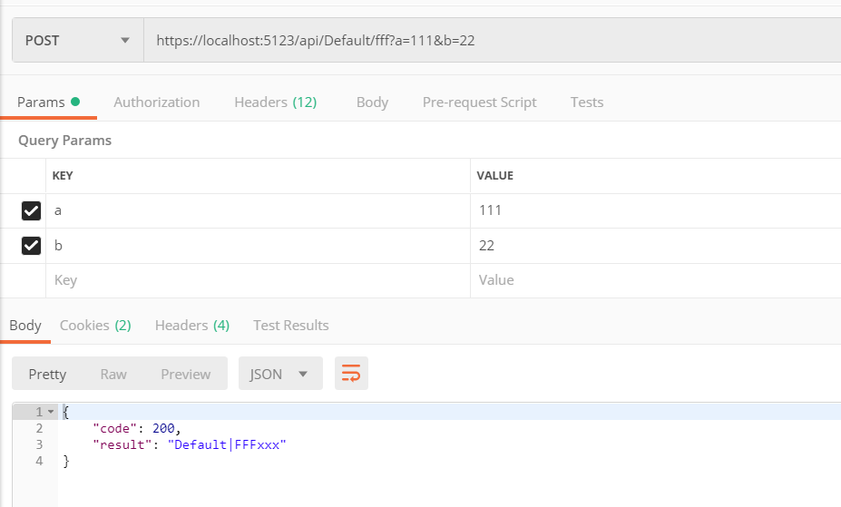
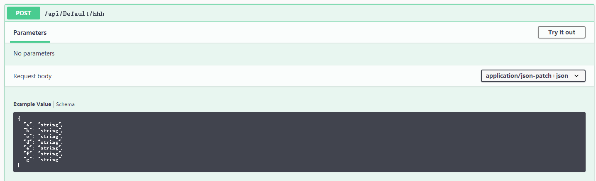
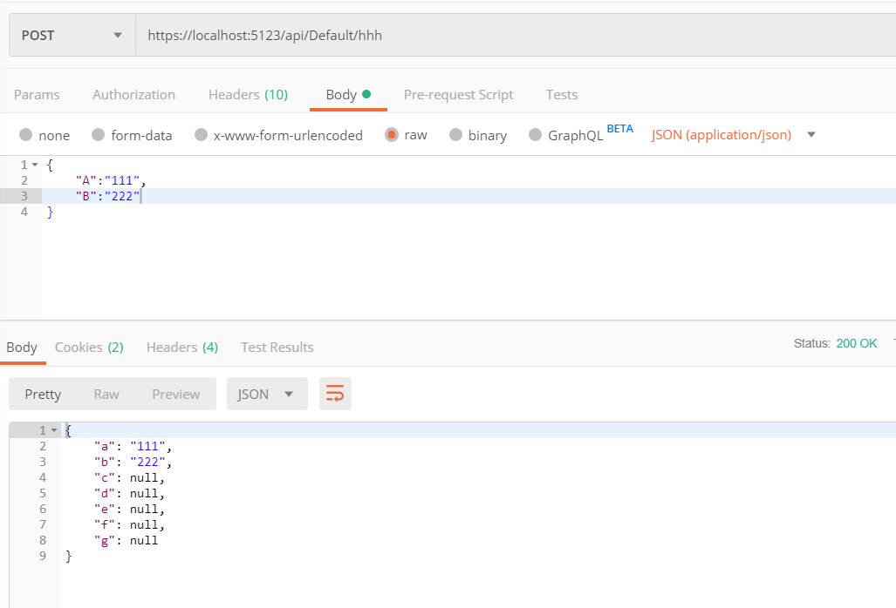
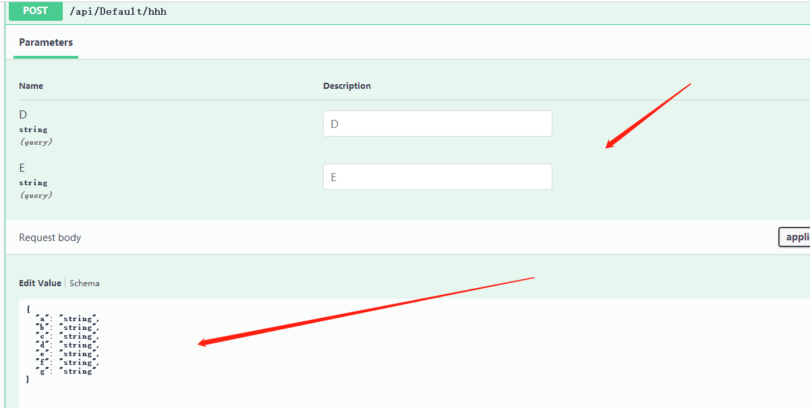
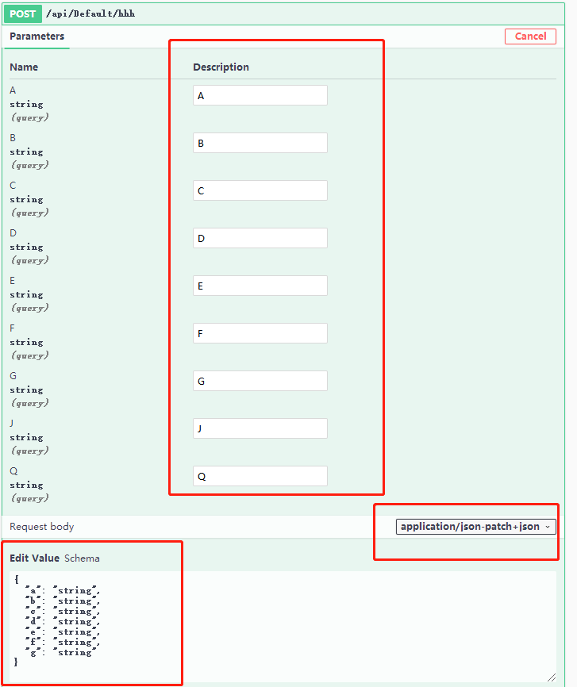
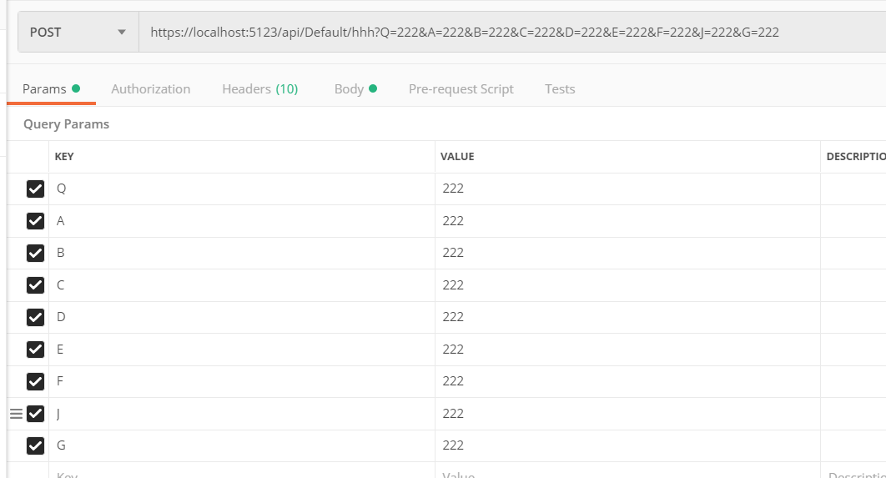
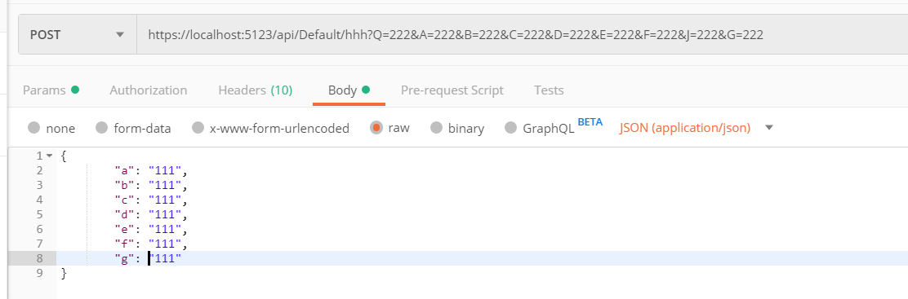

跟同事合作前后端分离项目，自己对 WebApi 的很多知识不够全，虽说不必要学全栈，可是也要了解基础知识，才能合理设计接口、API，方便与前端交接。

晚上回到宿舍后，对 WebApi 的知识查漏补缺，主要补充了 WebAPi 的一些方法、特性等如何与前端契合，如何利用工具测试 API 、Axios 请求接口。

本文主要写 WebApi 前端请求数据到 API 、后端返回处理结果，不涉及登录、跨域请求、前端 UI 等。(难一点我不会了。。。看张队的公众号，篇篇都看不懂。。。)

前提：会一点点 VUE、会一点 Axios、会一点点 Asp.net Core。

工具：Visual Studio 2019(或者其它版本) + Visual Studio  Code + Swagger +Postman

由于 Visual Studio 2019 写 ASP.NET Core 页面时，没有 Vue 的智能提示，所以需要使用 VSCode 来写前端页面。

目录 
一. 微软WebApi

　　1. 安装 Swagger

二. 数据绑定与获取

　　1，默认不加

　　2, [FromBody]

　　3, [FromForm]

　　4, [FromHeader]

　　5, [FromQuery]

　　6, [FromRoute]

　　7, [FromService]

三. action 特性方法

　　1, [Route]

　　2, [Bind]

　　3, [Consumes]、[Produces]

　　4, [HttpGet]、[HttpPost]、[HttpDelete]、[HttpPut]

四，返回类型

　　1, 查询备忘表

　　2, 返回的数据类型

　　3, 直接返回基元或复杂数据类型

　　4, IActionResult 类型

## 一. 微软WebApi

| 特性           | 绑定源                     |
| :------------- | :------------------------- |
| [FromBody]     | 请求正文                   |
| [FromForm]     | 请求正文中的表单数据       |
| [FromHeader]   | 请求标头                   |
| [FromQuery]    | 请求查询字符串参数         |
| [FromRoute]    | 当前请求中的路由数据       |
| [FromServices] | 作为操作参数插入的请求服务 |

来一张 Postman 的图片：

.png)

HTTP 请求中，会携带很多参数，这些参数可以在前端设置，例如表单、Header、文件、Cookie、Session、Token等。

那么，上面的表格正是用来从 HTTP 请求中获取数据的 `“方法”` 或者说 `“手段”`。HttpContext 等对象不在本文讨论范围。

`Microsoft.AspNetCore.Mvc` 命名空间提供很多用于配置Web API 控制器的行为和操作方法的属性：

| 特性        | 说明                                     |
| :---------- | :--------------------------------------- |
| [Route]     | 指定控制器或操作的 URL 模式。            |
| [Bind]      | 指定要包含的前缀和属性，以进行模型绑定。 |
| [Consumes]  | 指定某个操作接受的数据类型。             |
| [Produces]  | 指定某个操作返回的数据类型。             |
| [HttpGet]   | 标识支持 HTTP GET 方法的操作。           |
| [HttpPost]  | 标识支持 HTTP POST 方法的操作。          |
| ... ... ... | ... ... ...                              |

**WebApi 应用**

首先创建一个 Asp.Net Core MVC 应用，然后在 Controllers 目录添加一个 API 控制器 `DefaultController.cs`。(这里不创建 WebApi 而是 创建 MVC，通过 MVC 创建 API 控制器)。

创建后默认代码：

```c#
[Route("api/[controller]")]
[ApiController]
public class DefaultController : ControllerBase
{
}
```

##### **1. 安装 Swagger** 

在 Nuget 中搜索 `Swashbuckle.AspNetCore`，或打开 `程序包管理器控制台 -> 程序包管理器控制台` ，输入以下命令进行安装

```powershell
Install-Package Swashbuckle.AspNetCore -Version 5.0.0-rc2
```

打开 `Startup` 文件，添加引用

```c#
using Microsoft.OpenApi.Models;
```

上面是微软文档的安装方法，结果笔者测试。如果使用 `Nuget` 搜索，出现 `Swashbuckle.AspNetCore 4.0.1` 及以上，应当是引用

```
using Swashbuckle.AspNetCore.Swagger;

```


在 `ConfigureServices` 中添加服务，双引号文字内容随便改。

```c#
            services.AddSwaggerGen(c =>
            {
                c.SwaggerDoc("v1", new OpenApiInfo { Title = "My API", Version = "v1" });
            });
```

报错，则使用

```c#
            services.AddSwaggerGen(c =>
            {
                c.SwaggerDoc("v1", new Info { Title = "My API", Version = "v1" });
            });
            services.AddMvc().SetCompatibilityVersion(CompatibilityVersion.Version_2_2);
```

添加中间件

```c#
            app.UseHttpsRedirection();
            app.UseStaticFiles();
            app.UseCookiePolicy();

			// 添加下面的内容
            app.UseSwagger();
            app.UseSwaggerUI(c =>
            {
                c.SwaggerEndpoint("/swagger/v1/swagger.json", "My API V1");
            });
```

访问 `/swagger` 可以访问到 Swagger 的 UI 界面。

为了便于查看输出和固定端口，打开 `Progarm,cs` ，修改内容

```c#
        public static IWebHostBuilder CreateWebHostBuilder(string[] args) =>
            WebHost.CreateDefaultBuilder(args)
            .UseUrls("https://*:5123")
                .UseStartup<Startup>();
```

.png)

不要使用 IIS 托管运行。

注意：本文全部使用 [HttpPost] ；全局使用 JsonResult 作为返回类型。

## 二. 数据绑定与获取

##### 1，默认不加

直接写 `action`，不使用特性，对于简单类型是 Query，对于复杂类型是 Json。  
微软官方文档这样说明：

```
默认情况下，模型绑定以键值对的形式从 HTTP 请求中的以下源中获取数据：
	表单域
	请求正文（对于具有 [ApiController] 属性的控制器。）
	路由数据
	查询字符串参数
	上传的文件
对于每个目标参数或属性，将按此列表中指示的顺序扫描源。 有几个例外情况：
	路由数据和查询字符串值仅用于简单类型。
	上传的文件仅绑定到实现 IFormFile 或 IEnumerable<IFormFile> 的目标类型。
	
```

也就是说，对于 WebApi 来说，如果默认不加任何注解，简单类型默认为 Query ，复杂类型为 Json。  
如何是 MVC ，复杂类型则回产生多种情况，根据顺序进行区配。简单类型依然是 Query 。

这里先说 Query ，对于复杂类型(模型类等)，在后面说明。  
Query: 

```c#
        [HttpPost("aaa")]
        public async Task<JsonResult> AAA(int? a, int? b)
        {
            if (a == null || b == null)
                return new JsonResult(new { code = 0, result = "aaaaaaaa" });
            return new JsonResult(new { code = 2000, result = a + "|" + b });
        }
```

打开 https://localhost:5123/swagger/index.html 查看 UI 界面
.png)

也就是说，创建一个 `action` ，什么都不加，默认是 `query`。

**通过 Postman 提交数据、测试接口**

.png)

**对于 Query 的 action 来说， axios 的写法**

```javascript
    postaaa: function () {
                    axios.post('/api/default/aaa?a=111&b=222'
                    )
                        .then(res => {
                            console.log(res.data)
                            console.log(res.data.code)
                            console.log(res.data.result)
                        })
                        .catch(err => {
                            console.error(err);
                        })
                }
```

在网上查找资料时，发现有人说通过 params 添加数据也可以，不过笔者测试，貌似不行。

讲道理，别人可以，为啥我不行。。。

axios 代码：

```javascript
  postaaa: function () {
                    axios.post('/api/default/aaa', {
                        params: {
                            a: 123,
                            b: 234
                        }
                    }
                    )
                        .then(res => {
                            console.log(res.data)
                            console.log(res.data.code)
                            console.log(res.data.result)
                        })
                        .catch(err => {
                            console.error(err);
                        })
                }
```

包括下面的，都试过了，不行。

```
    axios.post('/api/default/aaa', {
                            a:1234,
                            b:1122
                    }
                    
                    
    axios.post('/api/default/aaa', {
                        data:{
                            a:1234,
                            b:1122
                        }
                    }
```

把 `[HttpPost]` 改成 `[HttpGet]` ，则可以使用 

```javascript
axios.post('/api/default/aaa', {
                        params: {
                            a: 123,
                            b: 234
                        }
                    }
                    ... ...
```

**提示：**

```javascript
		... ...
		.then(res => {
                            console.log(res.data)
                            console.log(res.data.code)
                            console.log(res.data.result)
                        })
                        .catch(err => {
                            console.error(err);
                        })
```

`.then` 当请求成功时触发，请求失败时触发 `catch` 。`res` 是请求成功后返回的信息，`res.data` 是请求成功后服务器返回的信息。即是 `action` 处理数据后返回的信息。

在浏览器，按下 <kbd>F12</kbd>  打开控制台，点击 Console ，每次请求后，这里会打印请求结果和数据。

##### 2, [FromBody]

官方文档解释：请求正文。[FromBody] 针对复杂类型参数进行推断。 [FromBody] 不适用于具有特殊含义的任何复杂的内置类型，如 IFormCollection 和 CancellationToken。 绑定源推理代码将忽略这些特殊类型。

算了，看得一头雾水，手动实际试试。

刚刚开始的时候，我这样使用：

```c#
        public async Task<JsonResult> BBB([FromBody]int? a, [FromBody]int? b)
```

结果编译时就报错，提示只能使用一个 [FromBody]，于是改成

```c#
        [HttpPost("bbb")]
        public async Task<JsonResult> BBB([FromBody]int? a, int? b)
        {
            if (a == null || b == null) 
                return new JsonResult(new { code = 0, result = "aaaaaaaa" });
            return new JsonResult(new { code = 2000, result = a + "|" + b });
        }
```

打开 Swagger UI 界面，刷新一下

.png)

从图片中发现，只有 b，没有 a，而且右上角有下拉框，说明了加 [FromBody] 是 json 上传。

那么说明 [FromBody] 修饰得应当是对象，而不是 字段。

修改程序如下：

```c#
	// 增加一个类型
    public class AppJson
    {
        public int? a { get; set; }
        public int? b { get; set; }
    }
    [HttpPost("bbb")]
    public async Task<JsonResult> BBB([FromBody]AppJson ss)
    {
        if (ss.a == null || ss.b == null) 
            return new JsonResult(new { code = 0, result = "aaaaaaaa" });
        return new JsonResult(new { code = 2000, result = ss.a + "|" + ss.b });
    }
```

再看看微软的文档：`[FromBody] 针对复杂类型参数进行推断。`，这下可理解了。。。

即是不应该对 int、string 等类型使用 [FromBody] ，而应该使用一个 `复杂类型`。

而且，一个 action 中，应该只能使用一个  [FromBody] 。

打开 Swagger 界面（有修改需要刷新下界面，下面不再赘述）。

.png)

这样才是我们要的结果嘛，前端提交的是 Json 对象。

**用 Postman 测试下**

.png)

证实了猜想，嘿嘿，嘿嘿嘿。

前端提交的是 Json 对象，遵循 Json 的格式规范，那么 [FromBody]  把它转为 Object 对象。

前端 axios 写法：

```javascript
            methods: {
                postaaa: function () {
                    axios.post('/api/default/bbb', {
                        "a": 4444,
                        "b": 5555
                    })
                        .then(res => {
                            console.log(res.data)
                            console.log(res.data.code)
                            console.log(res.data.result)
                        })
                        .catch(err => {
                            console.error(err);
                        })
                }
            }
```


##### 3, [FromForm]

```c#
        [HttpPost("ccc")]
        public async Task<JsonResult> CCC([FromForm]int? a, [FromForm]int? b)
        {
            if (a == null || b == null)
                return new JsonResult(new { code = 0, result = "aaaaaaaa" });
            return new JsonResult(new { code = 200, result = a + "|" + b });
        }
```

当然，这样写也行，多个字段或者对象都可以

```c#
        [HttpPost("ccc")]
        public async Task<JsonResult> CCC([FromForm]AppJson ss)
        {
            if (ss.a == null || ss.b == null)
                return new JsonResult(new { code = 0, result = "aaaaaaaa" });
            return new JsonResult(new { code = 200, result = ss.a + "|" + ss.b });
        }
```

.png)

根据提示，使用 Postman 进行测试



事实上，这样也行 ↓

form-data 和 x-www.form-urlencoded 都是键值形式，文件 form-data 可以用来上传文件。具体的区别请自行查询。



axios 写法(把 Content-Type 字段修改成 form-data 或 x-www.form-urlencoded )

```c#
 postccc: function () {
                    let fromData = new FormData()
                    fromData.append('a', 111)
                    fromData.append('b', 222)
                    axios.post('/api/default/ccc', fromData, {
                        headers: {
                            'Content-Type': 'application/x-www-form-urlencoded'
                        }
                    })
                        .then(res => {
                            console.log(res.data)
                            console.log(res.data.code)
                            console.log(res.data.result)
                        })
                        .catch(err => {
                            console.error(err);
                        })
                }
```


##### 4, [FromHeader]

[FromHeader] 不以表单形式上传，而是跟随 Header 传递参数。

```c#
        [HttpPost("ddd")]
        public async Task<JsonResult> DDD([FromHeader]int? a, [FromHeader]int? b)
        {
            if (a == null || b == null)
                return new JsonResult(new { code = 0, result = "aaaaaaaa" });
            return new JsonResult(new { code = 200, result = a + "|" + b });
        }
```

.png)

axios 写法

```javascript
postddd: function () {
                    axios.post('/api/default/ddd', {}, {
                        headers: {
                            a: 123,
                            b: 133
                        }
                    })
                        .then(res => {
                            console.log(res.data)
                            console.log(res.data.code)
                            console.log(res.data.result)
                        })
                        .catch(err => {
                            console.error(err);
                        })
                }
```

需要注意的是，headers 的参数，必须放在第三位。没有要提交的表单数据，第二位就使用 {} 代替。

params 跟随 url 一起在第一位，json 或表单数据等参数放在第二位，headers 放在第三位。

由于笔者对前端不太熟，这里有说错，麻烦大神评论指出啦。


##### 5, [FromQuery]

前面已经说了，Action 参数不加修饰，默认就是  [FromQuery] ，参考第一小节。

有个地方需要记住， Action 参数不加修饰。默认就是   [FromQuery] ，有时几种参数并在一起放到 Action 里，会忽略掉，调试时忘记了，造成麻烦。

##### 6, [FromRoute]

获取路由规则，这个跟前端上传的参数无关；跟 URL 可以说有关，又可以说无关。

```c#
        [HttpPost("fff")]
        public async Task<JsonResult> FFFxxx(int a,int b,
                                             [FromRoute]string controller,
                                             [FromRoute]string action)
        {
            // 这里就不处理 a和 b了
            return new JsonResult(new { code = 200, result = controller+"|"+action });
        }
```



[FromRoute] 是根据路由模板获取的，上面 API 的两个参数和路由模板的名称是对应的：

```c#
[FromRoute]string controller, [FromRoute]string action
```

```c#
            app.UseMvc(routes =>
            {
                routes.MapRoute(
                    name: "default",
                    template: "{controller=Home}/{action=Index}/{id?}");
            });
```

当然，还可以加个 `[FromRoute]int? id`


**[FromRoute] 和 [FromQuery] 区别**

以此 URL 为例

`https://localhost:5123/api/Default/fff?a=111&b=22`

Route 会查到 `controller = Default` ，`action = FFFxxx` 。查询到的是代码里的真实名称。

Query 会查询到 `a = 111`  和 `b = 22`

那么，如果路由规则里，不在 URL 里出现呢？

```c#
        [HttpPost("/ooo")]
        public async Task<JsonResult> FFFooo(int a, int b,
                                             [FromRoute]string controller,
                                             [FromRoute]string action)
        {
            // 这里就不处理 a和 b了
            return new JsonResult(new { code = 200, result = controller + "|" + action });
        }
```

那么，访问地址变成 `https://localhost:5123/ooo`

通过 Postman ，测试


说明了 [FromRoute] 获取的是代码里的 Controller 和 Action 名称，跟 URL 无关，根据测试结果推断跟路由表规则也无关。


##### 7,  [FromService]

参考 https://docs.microsoft.com/en-us/aspnet/core/mvc/controllers/dependency-injection?view=aspnetcore-2.2

这个是与依赖注入容器有关，跟 URL 、路由等无关。

新建一个接口、一个类

```c#
    public interface ITest
    {
        string GGG { get; }
    }
    public class Test : ITest
    {
        public string GGG { get { return DateTime.Now.ToLongDateString(); } }
    }
```

在 `ConfigureServices` 中 注入

```c#
            services.AddSingleton<ITest, Test>();
```

在 `DefaultController` 中，创建构造函数，然后

```c#
        private readonly ITest ggg;
        public DefaultController(ITest ttt)
        {
            ggg = ttt;
        }
```

添加一个 API

```c#
        [HttpPost("ggg")]
        public async Task<JsonResult> GGG([FromServices]ITest t)
        {
            return new JsonResult(new { code = 200, result = t.GGG });
        }
```

访问时，什么参数都不需要加，直接访问此 API 即可。

.png)

[FromService] 跟后端的代码有关，跟 Controller 、Action 、URL、表单数据等无关。


**小结：**

特性可以几种放在一起用，不过尽量每个 API 的参数只使用一种特性。

优先取值 `Form > Route > Query`。

IFromFile 由于文件的上传，本文就不谈这个了。

关于数据绑定，更详细的内容请参考：

https://docs.microsoft.com/zh-cn/aspnet/core/mvc/models/model-binding?view=aspnetcore-2.2


## 三. action 特性方法

`Microsoft.AspNetCore.Mvc` 命名空间提供可用于配置 Web API 控制器的行为和操作方法的属性。

下表是针对于 Controller 或 Action 的特性.

| 特性       | 说明                                     |
| :--------- | :--------------------------------------- |
| [Route]    | 指定控制器或操作的 URL 模式。            |
| [Bind]     | 指定要包含的前缀和属性，以进行模型绑定。 |
| [Consumes] | 指定某个操作接受的数据类型。             |
| [Produces] | 指定某个操作返回的数据类型。             |
| [HttpGet]  | 标识支持 HTTP GET 方法的操作。           |
| ...        | ...                                      |

 下面使用这些属性来指定 Controller 或 Action 接受的 HTTP 方法、返回的数据类型或状态代码。

##### 1, [Route]

在微软文档中，把这个特性称为 `属性路由` ，定义：属性路由使用一组属性将操作直接映射到路由模板。

请教了大神，大神解释说，ASP.NET Core 有路由规则表，路由表是全局性、唯一性的，在程序运行时，会把所有路由规则收集起来。

MVC 应用中设置路由的方法有多种，例如

```c#
            app.UseMvc(routes =>
            {
                routes.MapRoute(
                    name: "default",
                    template: "{controller=Home}/{action=Index}/{id?}");
            });
```

```c#
 [Route("Home/Index")]
   public IActionResult Index()
   {
      return View();
   }
```

```c#
    [Route("api/[controller]")]
    [ApiController]
    public class DefaultController : ControllerBase
    {
    }
```

路由是全局唯一的，可以通过不同形式使用，但是规则不能发生冲突，程序会在编译时把路由表收集起来。

根据笔者经验，发生冲突，应该就是在编译阶段直接报错了。(注：笔者不敢确定)

关于路由，请参考 ：

https://docs.microsoft.com/zh-cn/aspnet/core/mvc/controllers/routing?view=aspnetcore-2.2#token-replacement-in-route-templates-controller-action-area


##### 2, [Bind]

笔者知道这个是绑定模型的，但是对原理不太清楚。ASP.NET Core 自动生成的可读写的 Controller ，默认都是使用 [Bind] 来绑定数据。

文档定义：用于对复杂类型的模型绑定。

有下面几种相近的特性：

- `[BindRequired]`
- `[BindNever]`
- `[Bind]`

微软文档提示：如果发布的表单数据是值的源，则这些属性会影响模型绑定。

就是说，上面的特性是针对类、接口等复杂类型(下面统称模型)，对于 int、string 这些类型，可能出毛病。

[BindRequired] 、[BindNever] 只能应用于模型的属性，如

```c#
    public class TestB
    {
        [BindNever]
        public int ID { get; set; }

        [BindRequired]
        public string Name { get; set; }
    }
```

但是 [BindRequired] 、[BindNever] 不在讨论范围内，这里只说  [Bind]。

[Bind] 用于类或方法(Controller、Action)，指定模型绑定中应包含的模型属性。

在微软官方文档，对于[Bind] 的解释：

- `[Bind]` 属性可用于防止“创建”方案中的过多发布情况 。 由于排除的属性设置为 NULL 或默认值，而不是保持不变，因此它在编辑方案中无法很好地工作；
- 因为 `Bind` 特性将清除未在 某个 参数中列出的字段中的任何以前存在的数据。

一脸懵逼。

下面是我的踩坑过程，不感兴趣的话直接跳过吧。笔记笔记，记得当然是自己觉得要记的哈哈哈。

新建一个类

```c#
    public class TestBind
    {
        public string A { get; set; }
        public string B { get; set; }
        public string C { get; set; }
        public string D { get; set; }
        public string E { get; set; }
        public string F { get; set; }
        public string G { get; set; }
    }
```

新建 API

```c#
        [HttpPost("hhh")]
        public async Task<JsonResult> HHH([Bind("A,B,C")] TestBind test)
        {
            if (ModelState.IsValid == true)
                return new JsonResult(test);
            return new JsonResult(new { Code = 0, Result = "验证不通过" });
        }
```



使用 Postman 进行，测试，发现必须使用 Json 形式，才能访问到这个 Action ，其它方式会直接 返回 错误。

```json
{
    "errors": {
        "": [
            "A non-empty request body is required."
        ]
    },
    "title": "One or more validation errors occurred.",
    "status": 400,
    "traceId": "0HLO03IFQFTQU:00000007"
}
```

**通过两次 Postman 进行测试**




经过测试，我猜想

ModelState.IsValid 跟模型里的验证规则有关系，跟 [Bind] 没关系(尽管用于测试的 TestB 类中没有写验证规则)，因此不能使用 ModelState.IsValid 验证 [Bind] 是否符合规则。

Action 的参数：`[Bind("A,B,C")] TestBind test`，刚开始的时候我以为请求的数据中必须包含 A、B、C。

测试后发现不是。。。再认真看了文档 ：因为 `Bind` 特性将清除未在 某个 参数中列出的字段中的任何以前存在的数据。

我修改一下：

```c#
        [HttpPost("hhh")]
        public async Task<JsonResult> HHH(
            string D, string E,[Bind("A,B,C")] TestBind test)
        {
            if (ModelState.IsValid == true)
                return new JsonResult(new { data1 = test, data2 = D, data3 = E });
            return new JsonResult(new { Code = 0, Result = "验证不通过" });
        }
```

参数变成了 ` string D, string E,[Bind("A,B,C")] TestBind test`

使用 Swagger 进行测试：

返回结果

```c#
{
  "data1": {
    "a": "string",
    "b": "string",
    "c": "string",
    "d": "string",
    "e": "string",
    "f": "string",
    "g": "string"
  },
  "data2": null,
  "data3": null
}
```

改成

```c#
        [HttpPost("hhh")]
        public async Task<JsonResult> HHH([Bind("A,B,C")] TestBind test, string J, string Q)
        {
            if (ModelState.IsValid == true)
                return new JsonResult(new { data1 = test, data2 = J, data3 = Q });
            return new JsonResult(new { Code = 0, Result = "验证不通过" });
        }
```

返回结果

```c#
{
  "data1": {
    "a": "string",
    "b": "string",
    "c": "string",
    "d": "string",
    "e": "string",
    "f": "string",
    "g": "string"
  },
  "data2": null,
  "data3": null
}
```

文档中对 [Bind] 描述最多的是：防止过多发布。

通过上面的测试，首先肯定的是一个 Action 里，有多个参数 如

 `[Bind("A,B,C")] TestBind test, string D, string E string J, string Q`。

注意，下面的结论是错的！

那么 D、E 因为于 除了 Test， J、Q就会无效，通过百度，[Bind] 修饰的 Action ，前端请求的数据只有 Test 里面的数据有效，其它 Query等形式一并上传的数据都会失效，防止黑客在提交数据时掺杂其它特殊参数。应该就是这样理解吧。

上面是一开始我的结论，直到多次测试，我发现是错的。

可是有一个地方不明白，

```c#
[Bind("A,B,C")]
```

```c#
[Bind("A,B,C,D,E,F,G")]
```

这两者的区别是是什么。还是没搞清楚。

突然想到 Query，当字段没有使用特性修饰时，默认为 Query 。

**最终踩坑测试代码**

模型类

```c#
    public class TestBind
    {
        public string A { get; set; }
        public string B { get; set; }
        public string C { get; set; }
        public string D { get; set; }
        public string E { get; set; }
        public string F { get; set; }
        public string G { get; set; }
    }
```

Action 

```c#
        [HttpPost("hhh")]
        public async Task<JsonResult> HHH(
            string A, string B,
            string E, string F, string G,
            [Bind("A,B,C,D")] TestBind test,
             string C, string D,
             string J, string Q)
        {
            if (ModelState.IsValid == true)
                return new JsonResult(new
                {
                    data1 = test,
                    dataA = A,
                    dataB = B,
                    dataC = C,
                    dataD = D,
                    dataE = E,
                    dataF = F,
                    dataG = G,
                    dataJ = J,
                    dataQ = Q
                });
            return new JsonResult(new { Code = 0, Result = "验证不通过" });
        }
```

Swagger 测试



Postman 测试





```json
{
    "data1": {
        "a": "111",
        "b": "111",
        "c": "111",
        "d": "111",
        "e": "111",
        "f": "111",
        "g": "111"
    },
    "dataA": "222",
    "dataB": "222",
    "dataC": "222",
    "dataD": "222",
    "dataE": "222",
    "dataF": "222",
    "dataG": "222",
    "dataJ": "222",
    "dataQ": "222"
}
```

再在 Swagger 或 Postman ，换着法子尝试各种不同组合的输入。

我懵逼了。试了半天试不出什么。

实在不理解 [Bind] 里，“防止过多发布” 是什么意思

```c#
[Bind("A,B,C")]

```

```c#
[Bind("A,B,C,D,E,F,G")]

```

这两者的区别是是什么。还是没搞清楚。算了，不踩了。


我再到 stackoverflow 提问题，地址 https://stackoverflow.com/questions/56884876/asp-net-core-bind-how-to-use-it/56885153#56885153

获得一个回答：

```
What's the difference between [Bind("A,B,C")] and [Bind("A,B,C,D,E,F,G")]?

The former tells the model binder to include only the properties of TestBind named A, B and C. The latter tells the model binder to include those same properties plus D, E, F and G.

Are you testing by posting data for all properties of your model? You should notice that the values you post for the excluded properties are not bound.

```

算了，嘿嘿，测试不出来，放弃。


##### 3, [Consumes]、[Produces]

```c#
        [Consumes("application/json")]
        [Produces("application/json")]
        [Produces("application/xml")] 
        [Produces("text/html")]
		... ...
```

目前只了解到 [Consumes]、[Produces] 是筛选器，用来表示 Controller 或 Action 所能接受的数据类型。大概就是像下面这样使用：

```
    [Consumes("application/json")]
    [Produces("application/json")]
    public class DefaultTestController : ControllerBase
    {

    }

```

但是如何实际应用呢？我找了很久，都没有找到什么结果。在 stackoverflow 找到一个回答：

https://stackoverflow.com/questions/41462509/adding-the-produces-filter-globally-in-asp-net-core


##### 4, [HttpGet]、[HttpPost]、[HttpDelete]、[HttpPut]

修饰 Action ，用来标识这个 Action 能够通过什么方式访问、访问名称。

例如：

```c#
    [Route("api/[controller]")]
    [ApiController]
    public class DefaultController : ControllerBase
    {
        [HttpPost("aaa")]
        public async Task<JsonResult> AAA(int? a, int? b)
        {
            if (a == null | b == null)
                return new JsonResult(new { code = 0, result = "aaaaaaaa" });
            return new JsonResult(new { code = 200, result = a + "|" + b });
        }
    }

```

访问地址 https://localhost:5123/api/Default/aaa

使用时，会受到 Controller 和 Action 路由的影响。

但 本身亦可控制路由。以上面的控制器为例

```c#
[HttpPost("aaa")]    //相对路径

```

访问地址 `xxx:xxx/api/Default/aaa`

```c#
[HttpPost("/aaa")]   //绝对路径

```

访问地址 `xxx:xxx/aaa`


## 四，返回类型

##### 1, 查询备忘表

 `Microsoft.AspNetCore.Mvc` 命名空间中，包含控制 MVC 的各种操作方法和类型，笔者从命名空间中抽出与 MVC 或 API 返回类型有关的类型，生成表格：

| 类型                                                         | 描述                                                         |
| ------------------------------------------------------------ | ------------------------------------------------------------ |
| [AcceptedAtActionResult](https://docs.microsoft.com/zh-cn/dotnet/api/microsoft.aspnetcore.mvc.acceptedatactionresult?view=aspnetcore-2.2) | An [ActionResult](https://docs.microsoft.com/zh-cn/dotnet/api/microsoft.aspnetcore.mvc.actionresult?view=aspnetcore-2.2) that returns a Accepted (202) response with a Location header. |
| [AcceptedAtRouteResult](https://docs.microsoft.com/zh-cn/dotnet/api/microsoft.aspnetcore.mvc.acceptedatrouteresult?view=aspnetcore-2.2) | An [ActionResult](https://docs.microsoft.com/zh-cn/dotnet/api/microsoft.aspnetcore.mvc.actionresult?view=aspnetcore-2.2) that returns a Accepted (202) response with a Location header. |
| [AcceptedResult](https://docs.microsoft.com/zh-cn/dotnet/api/microsoft.aspnetcore.mvc.acceptedresult?view=aspnetcore-2.2) | An [ActionResult](https://docs.microsoft.com/zh-cn/dotnet/api/microsoft.aspnetcore.mvc.actionresult?view=aspnetcore-2.2) that returns an Accepted (202) response with a Location header. |
| [AcceptVerbsAttribute](https://docs.microsoft.com/zh-cn/dotnet/api/microsoft.aspnetcore.mvc.acceptverbsattribute?view=aspnetcore-2.2) | Specifies what HTTP methods an action supports.              |
| [ActionResult](https://docs.microsoft.com/zh-cn/dotnet/api/microsoft.aspnetcore.mvc.actionresult?view=aspnetcore-2.2) | A default implementation of [IActionResult](https://docs.microsoft.com/zh-cn/dotnet/api/microsoft.aspnetcore.mvc.iactionresult?view=aspnetcore-2.2). |
| [ActionResult](https://docs.microsoft.com/zh-cn/dotnet/api/microsoft.aspnetcore.mvc.actionresult-1?view=aspnetcore-2.2) | A type that wraps either an `TValue` instance or an [ActionResult](https://docs.microsoft.com/zh-cn/dotnet/api/microsoft.aspnetcore.mvc.actionresult?view=aspnetcore-2.2). |
| [BadRequestObjectResult](https://docs.microsoft.com/zh-cn/dotnet/api/microsoft.aspnetcore.mvc.badrequestobjectresult?view=aspnetcore-2.2) | An [ObjectResult](https://docs.microsoft.com/zh-cn/dotnet/api/microsoft.aspnetcore.mvc.objectresult?view=aspnetcore-2.2) that when executed will produce a Bad Request (400) response. |
| [BadRequestResult](https://docs.microsoft.com/zh-cn/dotnet/api/microsoft.aspnetcore.mvc.badrequestresult?view=aspnetcore-2.2) | A [StatusCodeResult](https://docs.microsoft.com/zh-cn/dotnet/api/microsoft.aspnetcore.mvc.statuscoderesult?view=aspnetcore-2.2) that when executed will produce a Bad Request (400) response. |
| [ChallengeResult](https://docs.microsoft.com/zh-cn/dotnet/api/microsoft.aspnetcore.mvc.challengeresult?view=aspnetcore-2.2) | An [ActionResult](https://docs.microsoft.com/zh-cn/dotnet/api/microsoft.aspnetcore.mvc.actionresult?view=aspnetcore-2.2) that on execution invokes AuthenticationManager.ChallengeAsync. |
| [ConflictObjectResult](https://docs.microsoft.com/zh-cn/dotnet/api/microsoft.aspnetcore.mvc.conflictobjectresult?view=aspnetcore-2.2) | An [ObjectResult](https://docs.microsoft.com/zh-cn/dotnet/api/microsoft.aspnetcore.mvc.objectresult?view=aspnetcore-2.2) that when executed will produce a Conflict (409) response. |
| [ConflictResult](https://docs.microsoft.com/zh-cn/dotnet/api/microsoft.aspnetcore.mvc.conflictresult?view=aspnetcore-2.2) | A [StatusCodeResult](https://docs.microsoft.com/zh-cn/dotnet/api/microsoft.aspnetcore.mvc.statuscoderesult?view=aspnetcore-2.2) that when executed will produce a Conflict (409) response. |
| [ContentResult](https://docs.microsoft.com/zh-cn/dotnet/api/microsoft.aspnetcore.mvc.contentresult?view=aspnetcore-2.2) |                                                              |
| [CreatedAtActionResult](https://docs.microsoft.com/zh-cn/dotnet/api/microsoft.aspnetcore.mvc.createdatactionresult?view=aspnetcore-2.2) | An [ActionResult](https://docs.microsoft.com/zh-cn/dotnet/api/microsoft.aspnetcore.mvc.actionresult?view=aspnetcore-2.2) that returns a Created (201) response with a Location header. |
| [CreatedAtRouteResult](https://docs.microsoft.com/zh-cn/dotnet/api/microsoft.aspnetcore.mvc.createdatrouteresult?view=aspnetcore-2.2) | An [ActionResult](https://docs.microsoft.com/zh-cn/dotnet/api/microsoft.aspnetcore.mvc.actionresult?view=aspnetcore-2.2) that returns a Created (201) response with a Location header. |
| [CreatedResult](https://docs.microsoft.com/zh-cn/dotnet/api/microsoft.aspnetcore.mvc.createdresult?view=aspnetcore-2.2) | An [ActionResult](https://docs.microsoft.com/zh-cn/dotnet/api/microsoft.aspnetcore.mvc.actionresult?view=aspnetcore-2.2) that returns a Created (201) response with a Location header. |
| [EmptyResult](https://docs.microsoft.com/zh-cn/dotnet/api/microsoft.aspnetcore.mvc.emptyresult?view=aspnetcore-2.2) | Represents an [ActionResult](https://docs.microsoft.com/zh-cn/dotnet/api/microsoft.aspnetcore.mvc.actionresult?view=aspnetcore-2.2) that when executed will do nothing. |
| [FileContentResult](https://docs.microsoft.com/zh-cn/dotnet/api/microsoft.aspnetcore.mvc.filecontentresult?view=aspnetcore-2.2) | Represents an [ActionResult](https://docs.microsoft.com/zh-cn/dotnet/api/microsoft.aspnetcore.mvc.actionresult?view=aspnetcore-2.2) that when executed will write a binary file to the response. |
| [FileResult](https://docs.microsoft.com/zh-cn/dotnet/api/microsoft.aspnetcore.mvc.fileresult?view=aspnetcore-2.2) | Represents an [ActionResult](https://docs.microsoft.com/zh-cn/dotnet/api/microsoft.aspnetcore.mvc.actionresult?view=aspnetcore-2.2) that when executed will write a file as the response. |
| [FileStreamResult](https://docs.microsoft.com/zh-cn/dotnet/api/microsoft.aspnetcore.mvc.filestreamresult?view=aspnetcore-2.2) | Represents an [ActionResult](https://docs.microsoft.com/zh-cn/dotnet/api/microsoft.aspnetcore.mvc.actionresult?view=aspnetcore-2.2) that when executed will write a file from a stream to the response. |
| [ForbidResult](https://docs.microsoft.com/zh-cn/dotnet/api/microsoft.aspnetcore.mvc.forbidresult?view=aspnetcore-2.2) | An [ActionResult](https://docs.microsoft.com/zh-cn/dotnet/api/microsoft.aspnetcore.mvc.actionresult?view=aspnetcore-2.2) that on execution invokes AuthenticationManager.ForbidAsync. |
| [JsonResult](https://docs.microsoft.com/zh-cn/dotnet/api/microsoft.aspnetcore.mvc.jsonresult?view=aspnetcore-2.2) | An action result which formats the given object as JSON.     |
| [LocalRedirectResult](https://docs.microsoft.com/zh-cn/dotnet/api/microsoft.aspnetcore.mvc.localredirectresult?view=aspnetcore-2.2) | An [ActionResult](https://docs.microsoft.com/zh-cn/dotnet/api/microsoft.aspnetcore.mvc.actionresult?view=aspnetcore-2.2) that returns a Found (302), Moved Permanently (301), Temporary Redirect (307), or Permanent Redirect (308) response with a Location header to the supplied local URL. |
| [NotFoundObjectResult](https://docs.microsoft.com/zh-cn/dotnet/api/microsoft.aspnetcore.mvc.notfoundobjectresult?view=aspnetcore-2.2) | An [ObjectResult](https://docs.microsoft.com/zh-cn/dotnet/api/microsoft.aspnetcore.mvc.objectresult?view=aspnetcore-2.2) that when executed will produce a Not Found (404) response. |
| [NotFoundResult](https://docs.microsoft.com/zh-cn/dotnet/api/microsoft.aspnetcore.mvc.notfoundresult?view=aspnetcore-2.2) | Represents an [StatusCodeResult](https://docs.microsoft.com/zh-cn/dotnet/api/microsoft.aspnetcore.mvc.statuscoderesult?view=aspnetcore-2.2) that when executed will produce a Not Found (404) response. |
| [OkObjectResult](https://docs.microsoft.com/zh-cn/dotnet/api/microsoft.aspnetcore.mvc.okobjectresult?view=aspnetcore-2.2) | An [ObjectResult](https://docs.microsoft.com/zh-cn/dotnet/api/microsoft.aspnetcore.mvc.objectresult?view=aspnetcore-2.2) that when executed performs content negotiation, formats the entity body, and will produce a [Status200OK](https://docs.microsoft.com/zh-cn/dotnet/api/microsoft.aspnetcore.http.statuscodes.status200ok?view=aspnetcore-2.2) response if negotiation and formatting succeed. |
| [OkResult](https://docs.microsoft.com/zh-cn/dotnet/api/microsoft.aspnetcore.mvc.okresult?view=aspnetcore-2.2) | An [StatusCodeResult](https://docs.microsoft.com/zh-cn/dotnet/api/microsoft.aspnetcore.mvc.statuscoderesult?view=aspnetcore-2.2) that when executed will produce an empty [Status200OK](https://docs.microsoft.com/zh-cn/dotnet/api/microsoft.aspnetcore.http.statuscodes.status200ok?view=aspnetcore-2.2) response. |
| [PartialViewResult](https://docs.microsoft.com/zh-cn/dotnet/api/microsoft.aspnetcore.mvc.partialviewresult?view=aspnetcore-2.2) | Represents an [ActionResult](https://docs.microsoft.com/zh-cn/dotnet/api/microsoft.aspnetcore.mvc.actionresult?view=aspnetcore-2.2) that renders a partial view to the response. |
| [PhysicalFileResult](https://docs.microsoft.com/zh-cn/dotnet/api/microsoft.aspnetcore.mvc.physicalfileresult?view=aspnetcore-2.2) | A [FileResult](https://docs.microsoft.com/zh-cn/dotnet/api/microsoft.aspnetcore.mvc.fileresult?view=aspnetcore-2.2) on execution will write a file from disk to the response using mechanisms provided by the host. |
| [RedirectResult](https://docs.microsoft.com/zh-cn/dotnet/api/microsoft.aspnetcore.mvc.redirectresult?view=aspnetcore-2.2) | An [ActionResult](https://docs.microsoft.com/zh-cn/dotnet/api/microsoft.aspnetcore.mvc.actionresult?view=aspnetcore-2.2) that returns a Found (302), Moved Permanently (301), Temporary Redirect (307), or Permanent Redirect (308) response with a Location header to the supplied URL. |
| [RedirectToActionResult](https://docs.microsoft.com/zh-cn/dotnet/api/microsoft.aspnetcore.mvc.redirecttoactionresult?view=aspnetcore-2.2) | An [ActionResult](https://docs.microsoft.com/zh-cn/dotnet/api/microsoft.aspnetcore.mvc.actionresult?view=aspnetcore-2.2) that returns a Found (302), Moved Permanently (301), Temporary Redirect (307), or Permanent Redirect (308) response with a Location header. Targets a controller action. |
| [RedirectToPageResult](https://docs.microsoft.com/zh-cn/dotnet/api/microsoft.aspnetcore.mvc.redirecttopageresult?view=aspnetcore-2.2) | An [ActionResult](https://docs.microsoft.com/zh-cn/dotnet/api/microsoft.aspnetcore.mvc.actionresult?view=aspnetcore-2.2) that returns a Found (302) or Moved Permanently (301) response with a Location header. Targets a registered route. |
| [RedirectToRouteResult](https://docs.microsoft.com/zh-cn/dotnet/api/microsoft.aspnetcore.mvc.redirecttorouteresult?view=aspnetcore-2.2) | An [ActionResult](https://docs.microsoft.com/zh-cn/dotnet/api/microsoft.aspnetcore.mvc.actionresult?view=aspnetcore-2.2) that returns a Found (302), Moved Permanently (301), Temporary Redirect (307), or Permanent Redirect (308) response with a Location header. Targets a registered route. |
| [SignInResult](https://docs.microsoft.com/zh-cn/dotnet/api/microsoft.aspnetcore.mvc.signinresult?view=aspnetcore-2.2) | An [ActionResult](https://docs.microsoft.com/zh-cn/dotnet/api/microsoft.aspnetcore.mvc.actionresult?view=aspnetcore-2.2) that on execution invokes AuthenticationManager.SignInAsync. |
| [SignOutResult](https://docs.microsoft.com/zh-cn/dotnet/api/microsoft.aspnetcore.mvc.signoutresult?view=aspnetcore-2.2) | An [ActionResult](https://docs.microsoft.com/zh-cn/dotnet/api/microsoft.aspnetcore.mvc.actionresult?view=aspnetcore-2.2) that on execution invokes AuthenticationManager.SignOutAsync. |
| [StatusCodeResult](https://docs.microsoft.com/zh-cn/dotnet/api/microsoft.aspnetcore.mvc.statuscoderesult?view=aspnetcore-2.2) | Represents an [ActionResult](https://docs.microsoft.com/zh-cn/dotnet/api/microsoft.aspnetcore.mvc.actionresult?view=aspnetcore-2.2) that when executed will produce an HTTP response with the given response status code. |
| [UnauthorizedObjectResult](https://docs.microsoft.com/zh-cn/dotnet/api/microsoft.aspnetcore.mvc.unauthorizedobjectresult?view=aspnetcore-2.2) | An [ObjectResult](https://docs.microsoft.com/zh-cn/dotnet/api/microsoft.aspnetcore.mvc.objectresult?view=aspnetcore-2.2) that when executed will produce a Unauthorized (401) response. |
| [UnauthorizedResult](https://docs.microsoft.com/zh-cn/dotnet/api/microsoft.aspnetcore.mvc.unauthorizedresult?view=aspnetcore-2.2) | Represents an [UnauthorizedResult](https://docs.microsoft.com/zh-cn/dotnet/api/microsoft.aspnetcore.mvc.unauthorizedresult?view=aspnetcore-2.2) that when executed will produce an Unauthorized (401) response. |
| [UnprocessableEntityObjectResult](https://docs.microsoft.com/zh-cn/dotnet/api/microsoft.aspnetcore.mvc.unprocessableentityobjectresult?view=aspnetcore-2.2) | An [ObjectResult](https://docs.microsoft.com/zh-cn/dotnet/api/microsoft.aspnetcore.mvc.objectresult?view=aspnetcore-2.2) that when executed will produce a Unprocessable Entity (422) response. |
| [UnprocessableEntityResult](https://docs.microsoft.com/zh-cn/dotnet/api/microsoft.aspnetcore.mvc.unprocessableentityresult?view=aspnetcore-2.2) | A [StatusCodeResult](https://docs.microsoft.com/zh-cn/dotnet/api/microsoft.aspnetcore.mvc.statuscoderesult?view=aspnetcore-2.2) that when executed will produce a Unprocessable Entity (422) response. |
| [UnsupportedMediaTypeResult](https://docs.microsoft.com/zh-cn/dotnet/api/microsoft.aspnetcore.mvc.unsupportedmediatyperesult?view=aspnetcore-2.2) | A [StatusCodeResult](https://docs.microsoft.com/zh-cn/dotnet/api/microsoft.aspnetcore.mvc.statuscoderesult?view=aspnetcore-2.2) that when executed will produce a UnsupportedMediaType (415) response. |
| [ViewComponentResult](https://docs.microsoft.com/zh-cn/dotnet/api/microsoft.aspnetcore.mvc.viewcomponentresult?view=aspnetcore-2.2) | An [IActionResult](https://docs.microsoft.com/zh-cn/dotnet/api/microsoft.aspnetcore.mvc.iactionresult?view=aspnetcore-2.2) which renders a view component to the response. |
| [ViewResult](https://docs.microsoft.com/zh-cn/dotnet/api/microsoft.aspnetcore.mvc.viewresult?view=aspnetcore-2.2) | Represents an [ActionResult](https://docs.microsoft.com/zh-cn/dotnet/api/microsoft.aspnetcore.mvc.actionresult?view=aspnetcore-2.2) that renders a view to the response. |
| [VirtualFileResult](https://docs.microsoft.com/zh-cn/dotnet/api/microsoft.aspnetcore.mvc.virtualfileresult?view=aspnetcore-2.2) | A [FileResult](https://docs.microsoft.com/zh-cn/dotnet/api/microsoft.aspnetcore.mvc.fileresult?view=aspnetcore-2.2) that on execution writes the file specified using a virtual path to the response using mechanisms provided by the host. |

留着写 WebApi 时查询备忘嘿嘿。

那些类型主要继承的两个接口：

| 类型                 | 描述                                                         |
| -------------------- | ------------------------------------------------------------ |
| IActionResult        | Defines a contract that represents the result of an action method. |
| IViewComponentResult | Result type of a [ViewComponent](https://docs.microsoft.com/zh-cn/dotnet/api/microsoft.aspnetcore.mvc.viewcomponent?view=aspnetcore-2.2). |

注意的是，上面有些是抽象类，例如 FileResult，而 FileStreamResult 实现了 FileResult 。有些类是继承关系。


##### 2, 返回的数据类型

1. 特定类型
2. IActionResult 类型
3. ActionResult 类型

Action 的 return ，返回的数据类型必定是上面三种。


##### 3, 直接返回基元或复杂数据类型

```c#
[HttpGet]
public IEnumerable<Product> Get()
{
    return _repository.GetProducts();
}

```

##### 4, IActionResult 类型

响应状态码、Json、重定向、URL 跳转等，属于 IActionResult。

MVC 的 Controller 与 API 的 Controller 有很多相同的地方，亦有很多不同的地方。

API 的 Controller 继承 ControllerBase

MVC 的 Controller 继承 Controller而 Controller 继承

```c#
Controller :   ControllerBase, IActionFilter, IFilterMetadata, IAsyncActionFilter, IDisposable

```

API 里的 Controller 是最原始的。

API 里的 返回类型需要实例化， new 一下； MVC 里的返回类型，“不需要实例化”。

当然，有些例如 FileResult 是抽象类，不能被实例化。

API:

```c#
        [HttpGet("returnaaa")]
        public async Task<IActionResult> ReturnAAA()
        {
            return new ViewResult();  
            return new JsonResult(new { code="test"});
            return new RedirectToActionResult("DefaultController","ReturnAAA","");
            return new NoContentResult("666");
            return new NotFoundResult();
            ...
        }

```

MVC 

```c#
        public async Task<IActionResult> Test()
        {
            return View();
            return Json(new { code = "test" });
            return RedirectToAction("DefaultController", "ReturnAAA", "");
            return NoContent("666");
            return NotFound();
            ...
        }

```

MVC 中，Action 默认是 [HttpGet]，不加也可以被访问到；

而 API 的Action，不加 [Httpxxx]，则默认不能被访问到。
